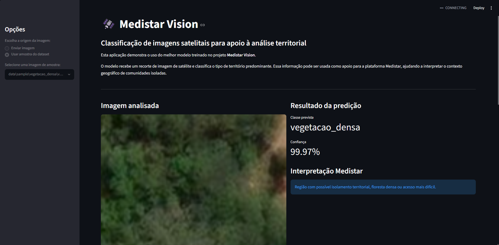

# Medistar Vision — Classificação de Imagens Satelitais com CNNs

Projeto desenvolvido para a disciplina **Applied Computer Vision (ACV)** da **Global Solution 2026 — Engenharia de Software FIAP**.

O objetivo do projeto é treinar e comparar redes neurais convolucionais criadas do zero para classificar recortes de imagens satelitais, apoiando a solução integrada **Medistar**, uma plataforma inteligente de telemedicina e vigilância em saúde para regiões isoladas.

---

## Integrantes

- Natan Eguchi dos Santos — RM: 98720
- Kayky Paschoal Ribeiro  — RM: 99929
- Lucas Yuji Farias Umada — RM: 99757
- João Pedro Marques Rodrigues — RM: 98307
- Gustavo Henrique Santos Bonfim — RM: 98864

---

## Contexto do Projeto

O **Medistar** é uma plataforma voltada para apoiar o atendimento médico em regiões isoladas, como comunidades ribeirinhas, áreas rurais, regiões de floresta, ilhas e localidades distantes de centros urbanos.

A proposta da plataforma é considerar não apenas os dados clínicos do paciente, mas também o contexto territorial, climático e estrutural da comunidade onde ele está localizado.

Nesse contexto, o módulo **Medistar Vision** utiliza Visão Computacional para classificar imagens satelitais e identificar características do território, como:

- área urbana;
- vegetação densa;
- vegetação esparsa;
- agricultura;
- sombra;
- terreno exposto.

Essas informações podem apoiar o cálculo de risco territorial da plataforma, ajudando a indicar se uma região possui maior dificuldade de acesso, possível isolamento geográfico ou menor infraestrutura disponível.

---

## Relação com a Indústria Espacial

O projeto se conecta à temática da Global Solution por utilizar **imagens satelitais** e técnicas de **sensoriamento remoto** para resolver um problema real na Terra: melhorar o apoio à tomada de decisão em saúde para comunidades remotas.

A análise de dados orbitais permite observar características do território que podem impactar diretamente o acesso ao atendimento médico, como presença de vegetação densa, áreas rurais, terrenos expostos e regiões urbanizadas.

---

## Objetivo de Visão Computacional

O problema de Visão Computacional abordado neste projeto é uma tarefa de **classificação de imagens**.

Cada imagem de entrada corresponde a um recorte de satélite de `128x128` pixels. O modelo deve identificar qual classe territorial predomina naquele recorte.

As classes finais utilizadas foram:

| Classe | Interpretação |
|---|---|
| `urbano` | Área construída ou urbanizada, com maior chance de infraestrutura |
| `vegetacao_densa` | Área de floresta ou vegetação fechada, podendo indicar maior isolamento |
| `vegetacao_esparsa` | Área com vegetação menos densa ou região de transição |
| `agricultura` | Área rural produtiva, possivelmente distante de centros urbanos |
| `terreno_exposto` | Solo aberto, estrada, clareira, área degradada ou terreno descoberto |
| `sombra` | Área com baixa visibilidade na imagem, podendo dificultar a análise territorial |

---

## Dataset Utilizado

O dataset utilizado contém imagens satelitais e suas respectivas máscaras segmentadas. As imagens originais estão no formato `.tif`, e as labels estão no formato `.png`.

A estrutura original utilizada localmente foi:

```text
data/
  raw/
    images/
    labels/
```

Como o dataset original é pesado, ele **não foi incluído integralmente no repositório**. Para fins de demonstração, foi adicionada uma amostra reduzida em:

```text
data/sample/
```

---

## Preparação e Pré-processamento dos Dados

O dataset original era voltado para segmentação semântica, pois cada imagem possuía uma máscara colorida indicando a classe de cada pixel.

Como a entrega de ACV exige um problema de **classificação de imagens**, o dataset foi adaptado da seguinte forma:

1. Cada imagem de satélite foi dividida em recortes de `128x128` pixels.
2. Para cada recorte, a máscara correspondente foi analisada.
3. A classe dominante da máscara foi utilizada como rótulo do recorte.
4. Foram aceitos apenas recortes em que a classe dominante ocupava pelo menos `60%` da área do patch.
5. A classe `água` foi removida do experimento principal por baixa representatividade.
6. As classes originais `rocha` e `solo_exposto` foram agrupadas em uma nova classe chamada `terreno_exposto`, devido à semelhança visual observada durante a inspeção dos recortes.

O script responsável por gerar o dataset processado é:

```text
src/build_classification_dataset.py
```

O notebook que documenta esse processo é:

```text
notebooks/01_geracao_dataset_classificacao.ipynb
```

O arquivo auxiliar que foi utilizado para inspecionar as cores RGB das máscaras segmentadas e mapear corretamente as classes do dataset é:

```text
src/debug_labels.py
```

---

## Distribuição Final do Dataset

Após o processamento, o dataset final ficou organizado em treino, validação e teste:

| Classe | Treino | Validação | Teste | Total |
|---|---:|---:|---:|---:|
| `urbano` | 560 | 120 | 120 | 800 |
| `vegetacao_densa` | 560 | 120 | 120 | 800 |
| `sombra` | 328 | 70 | 71 | 469 |
| `vegetacao_esparsa` | 560 | 120 | 120 | 800 |
| `agricultura` | 190 | 40 | 42 | 272 |
| `terreno_exposto` | 560 | 120 | 120 | 800 |

Total de imagens utilizadas: **3.941**.

---

## Arquiteturas dos Modelos

Foram treinadas duas arquiteturas de CNN criadas do zero, sem uso de modelos pré-treinados.

### CNN Simples — Baseline

A primeira arquitetura foi criada como modelo de referência, inspirada em uma CNN básica com duas etapas convolucionais seguidas por uma MLP.

Estrutura:

```text
Conv2D: 16 filtros, kernel 3x3, ReLU
MaxPooling2D: 2x2
Conv2D: 32 filtros, kernel 3x3, ReLU
MaxPooling2D: 2x2
Flatten
Dense: 64 neurônios, ReLU
Dropout: 0.3
Dense: 6 neurônios, Softmax
```

### CNN Intermediária

A segunda arquitetura foi criada para aumentar a capacidade de extração de características, utilizando mais filtros convolucionais, um bloco adicional e data augmentation leve.

Estrutura:

```text
RandomFlip horizontal
RandomRotation 0.03
RandomZoom 0.05
Conv2D: 32 filtros, kernel 3x3, ReLU
MaxPooling2D: 2x2
Conv2D: 64 filtros, kernel 3x3, ReLU
MaxPooling2D: 2x2
Conv2D: 128 filtros, kernel 3x3, ReLU
MaxPooling2D: 2x2
Flatten
Dense: 128 neurônios, ReLU
Dropout: 0.3
Dense: 6 neurônios, Softmax
```

O arquivo com a arquitetura dos modelos está em:

```text
outputs/architectures/
```

---

## Treinamento

O treinamento foi realizado no notebook:

```text
notebooks/02_treinamento_comparacao_cnns.ipynb
```

Configurações principais:

| Parâmetro | Valor |
|---|---|
| Tamanho da imagem | `128x128` |
| Canais | RGB |
| Batch size | `32` |
| Otimizador | Adam |
| Loss | Categorical Crossentropy |
| Métrica | Accuracy |
| Número de classes | `6` |

---

## Resultados

Os modelos foram avaliados no conjunto de teste.

| Modelo | Loss Teste | Acurácia Teste |
|---|---:|---:|
| CNN Simples | `0.3585` | `90.39%` |
| CNN Intermediária | `0.3136` | `90.05%` |

A **CNN Simples** foi escolhida como melhor modelo por apresentar a maior acurácia no conjunto de teste.

Embora a CNN Intermediária tenha apresentado uma loss menor, sua acurácia foi ligeiramente inferior. Isso indica que, para este dataset, uma arquitetura mais compacta foi suficiente para aprender os principais padrões visuais das classes, evitando complexidade desnecessária.

O melhor modelo foi salvo em:

```text
outputs/models/best_model.keras
```

Os gráficos e relatórios gerados estão em:

```text
outputs/plots/
outputs/reports/
```

---

## Demonstração Funcional

A demonstração funcional está no notebook:

```text
notebooks/03_demo_predicao_imagem_nova.ipynb
```

Esse notebook carrega o modelo salvo em `best_model.keras`, seleciona imagens do conjunto de teste ou da amostra do dataset e realiza a predição da classe territorial.

A saída da demonstração apresenta:

- imagem analisada;
- classe real;
- classe prevista;
- confiança da predição;
- interpretação operacional para o Medistar.

Exemplo de interpretação:

```text
Classe prevista: vegetacao_densa

Interpretação Medistar:
Região com possível isolamento territorial, floresta densa ou acesso mais difícil.
```

Além do notebook de demonstração, o projeto também possui uma aplicação simples em Streamlit:

```bash
streamlit run app/streamlit_app.py
```

A aplicação permite enviar uma imagem de satélite ou selecionar uma amostra do dataset, retornando a classe prevista, confiança da predição e interpretação operacional para o Medistar.


---

## Estrutura do Repositório

```text
medistar-vision-acv/
  data/
    sample/
      agricultura/
      sombra/
      terreno_exposto/
      urbano/
      vegetacao_densa/
      vegetacao_esparsa/

  notebooks/
    01_geracao_dataset_classificacao.ipynb
    02_treinamento_comparacao_cnns.ipynb
    03_demo_predicao_imagem_nova.ipynb

  outputs/
    architectures/
    models/
      best_model.keras
    plots/
    reports/

  src/
    build_classification_dataset.py
    debug_labels.py

  .gitignore
  README.md
  requirements.txt
```

---

## Como Executar o Projeto

### 1. Clonar o repositório

```bash
git clone https://github.com/Natan-TI/medistar-vision-acv
cd medistar-vision-acv
```

### 2. Criar ambiente virtual

No Windows:

```bash
python -m venv venv
venv\\Scripts\\activate
```

No macOS/Linux:

```bash
python3 -m venv venv
source venv/bin/activate
```

### 3. Instalar dependências

```bash
pip install -r requirements.txt
```

### 4. Gerar o dataset processado

Caso você tenha acesso ao dataset original, coloque as imagens e labels em:

```text
data/raw/images/
data/raw/labels/
```

Depois execute:

```bash
python src/build_classification_dataset.py
```

O script irá gerar:

```text
data/processed/train/
data/processed/val/
data/processed/test/
```

### 5. Treinar os modelos

Abra e execute o notebook:

```text
notebooks/02_treinamento_comparacao_cnns.ipynb
```

### 6. Executar a demonstração

Abra e execute o notebook:

```text
notebooks/03_demo_predicao_imagem_nova.ipynb
```

---

## Observações Sobre Arquivos Grandes

O dataset original e o dataset processado completo não foram incluídos no repositório devido ao tamanho dos arquivos.

Foram incluídas apenas amostras reduzidas em:

```text
data/sample/
```

O melhor modelo treinado foi incluído em:

```text
outputs/models/best_model.keras
```

---

## Tecnologias Utilizadas

- Python
- TensorFlow
- Keras
- NumPy
- Pandas
- Matplotlib
- Scikit-learn
- Pillow
- Jupyter Notebook
- Streamlit

---

## Conclusão

O projeto **Medistar Vision** demonstrou a aplicação de redes neurais convolucionais treinadas do zero para classificação de imagens satelitais.

A solução alcançou acurácia superior à referência mínima definida para a disciplina, com a CNN Simples atingindo **90,39%** no conjunto de teste.

A classificação territorial gerada pelo modelo pode ser utilizada como uma variável auxiliar dentro da plataforma Medistar, apoiando a análise de risco territorial e a priorização de atendimentos em comunidades isoladas.

Assim, o projeto integra Visão Computacional, dados satelitais e impacto social, conectando tecnologias da Indústria Espacial a um problema real de acesso à saúde em regiões remotas.
